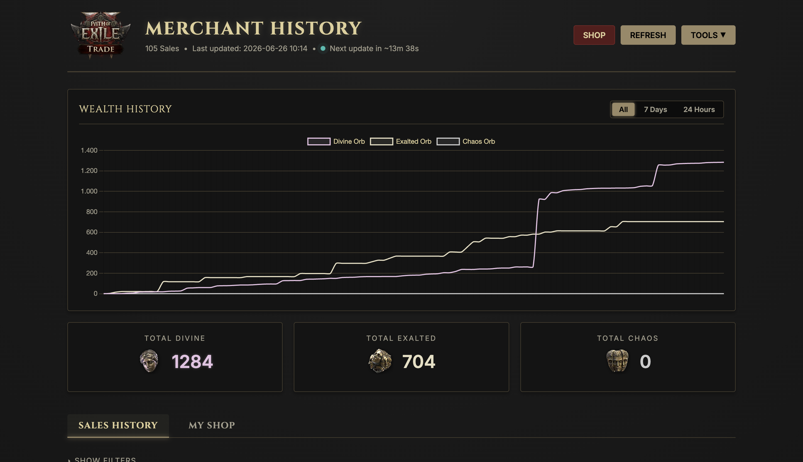
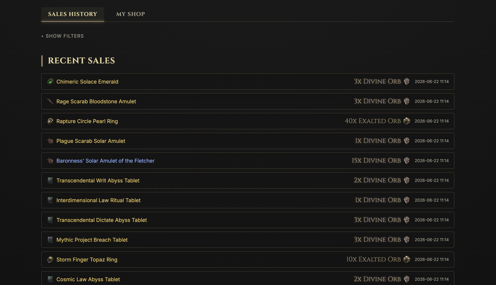
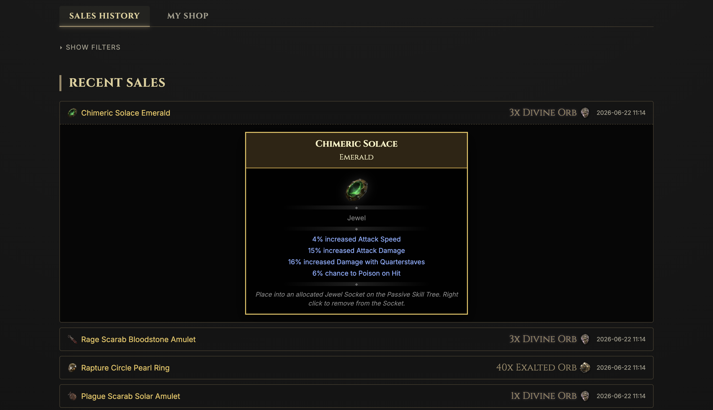

# PoE Monitor

A self-hosted Path of Exile (PoE) sales monitoring and notification tool. It monitors your character's stash and sales in Path of Exile 2, saving the transaction history to a local SQLite database, showing stats in a web interface, and pushing real-time sales alerts to your mobile phone/devices via **ntfy**.

## Screenshots

### Dashboard


### Recent Sales


### Item Details


## Features

- **Real-time Notifications:** Uses [ntfy](https://ntfy.sh) to send instant alerts for sales.
- **Web Dashboard:** View your sales history, stats, and wealth accumulation over time.
- **Session Auto-Update:** Update your `POESESSID` directly from the web interface if it expires.
- **Self-Hosted:** Fully containerized with Docker for easy deployment.

## Prerequisites

- Docker and Docker Compose installed on your server.
- An active `ntfy` server (or you can use the public `https://ntfy.sh` service).

## Setup & Installation

1. **Clone the repository** (or copy these files) to your server.
2. **Configure your environment:**
   Copy the example environment file:
   ```bash
   cp .env.example .env
   ```
   Open the `.env` file and fill in your details:
   - `POESESSID`: Your Path of Exile session cookie (see instructions below on how to retrieve it).
   - `NTFY_URL`: The URL of your ntfy server (e.g. `https://ntfy.sh` or your self-hosted instance).
   - `NTFY_TOPIC`: The topic you want to subscribe to on ntfy (e.g., `my-poe-sales`).
   - `POE_LEAGUE`: The league you want to monitor (e.g., `Runes of Aldur` or the current PoE 2 league).
   - `CHECK_INTERVAL`: The check interval in minutes (default is `30`).
   - `TRADE_SEARCH_ID`: The unique ID of your custom active shop listings search query from the Path of Exile trade website. Set this up by searching for instant buyouts from your PoE-Username.
   - `TZ`: Your local timezone (e.g., `Europe/Berlin`).

3. **Start the application:**
   ```bash
   docker compose up -d --build
   ```

4. **Access the Dashboard:**
   Open your browser and navigate to `http://<your-server-ip>:8060`.

---

## How to get your POESESSID

The `POESESSID` is a browser cookie used by pathofexile.com to authenticate your session. 

1. Go to [pathofexile.com](https://www.pathofexile.com) and log in.
2. Open your browser's Developer Tools (F12 or right-click -> Inspect).
3. Go to the **Application** tab (Chrome/Edge) or **Storage** tab (Firefox).
4. Expand **Cookies** and select `https://www.pathofexile.com`.
5. Find the cookie named `POESESSID` and copy its value.
6. Paste the value into your `.env` file or update it via the web interface.

> [!WARNING]
> Keep your `POESESSID` private. Anyone with access to this cookie can access your Path of Exile account. Do not commit your `.env` file or expose the web dashboard to the public internet without proper authentication/reverse proxy protection.
